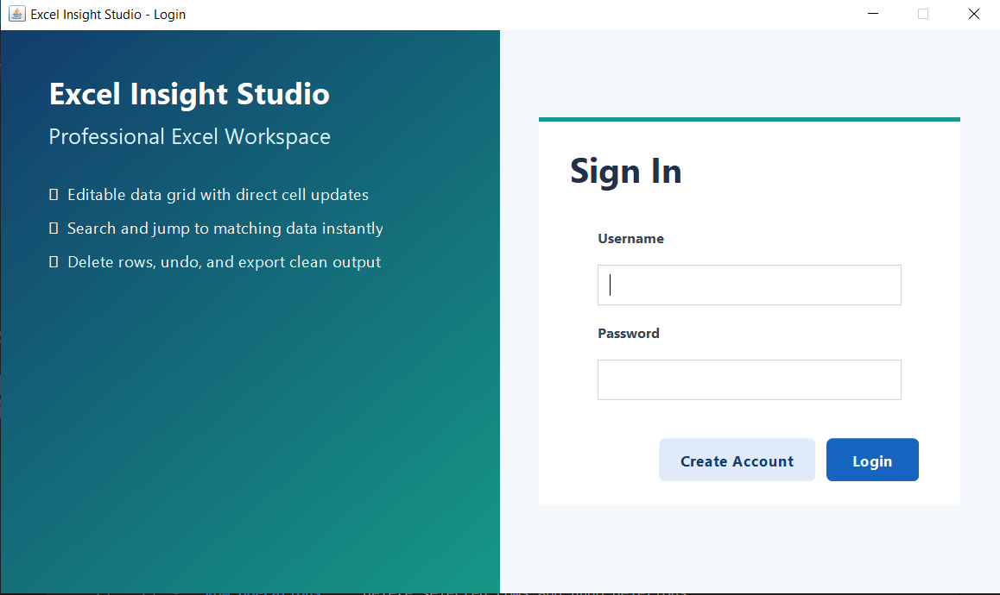
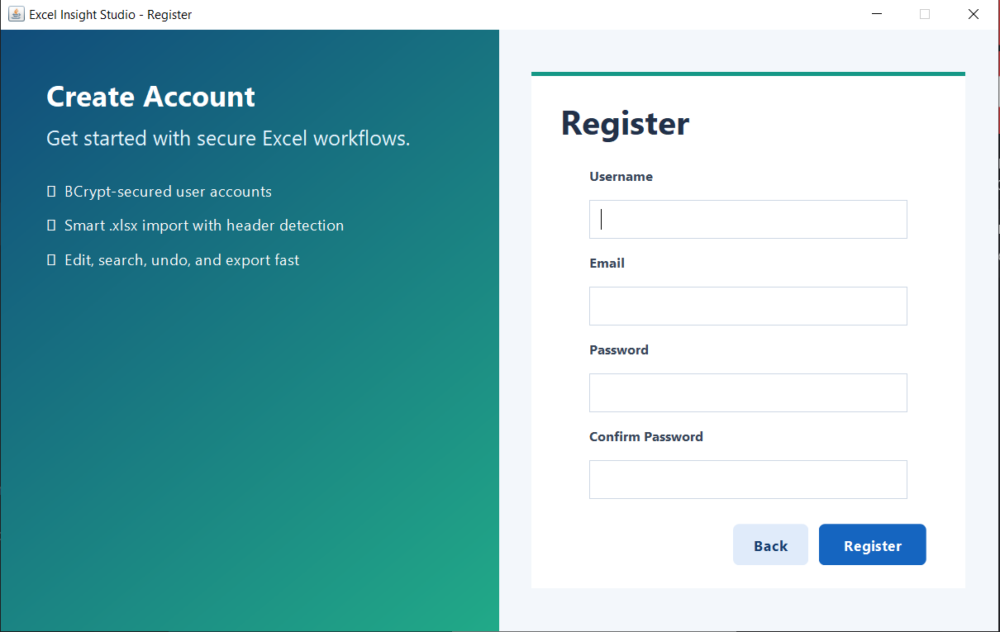
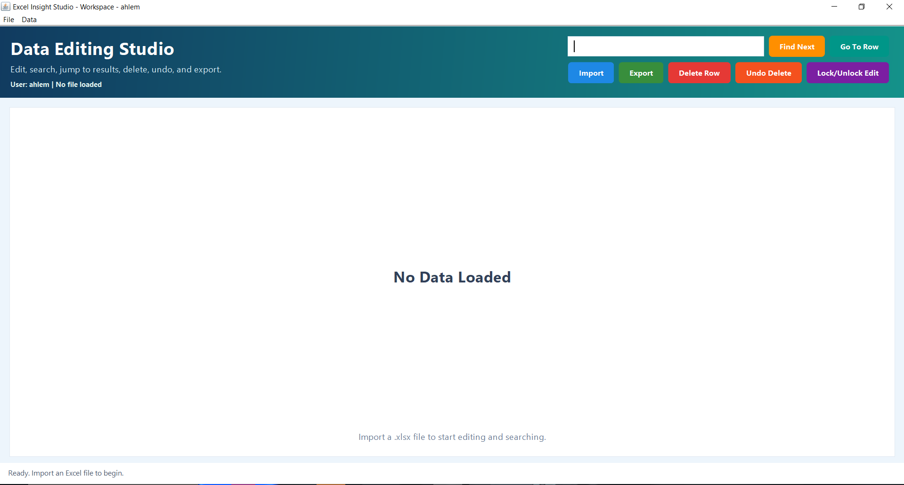
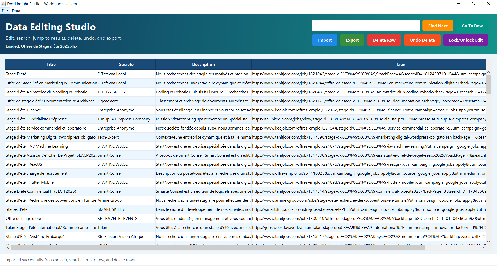
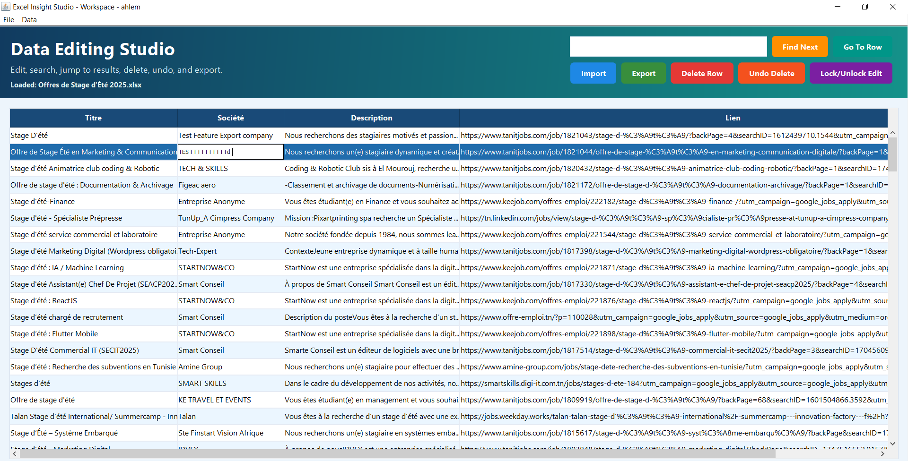
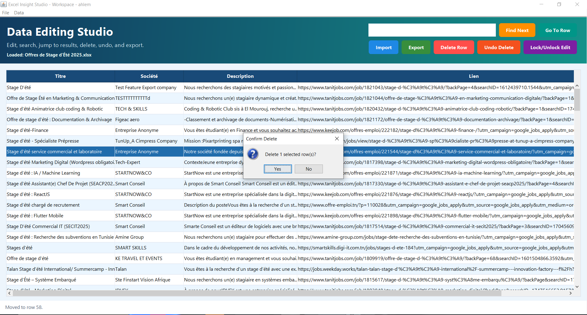
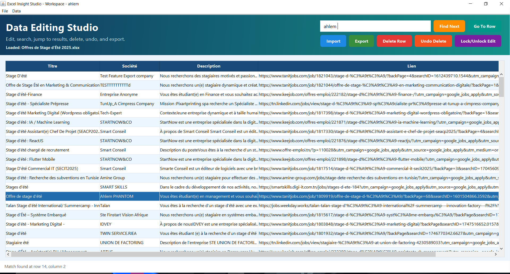
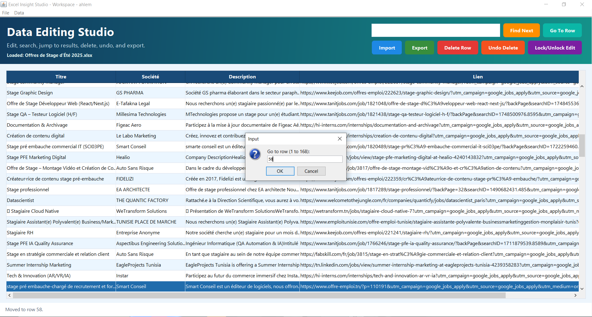
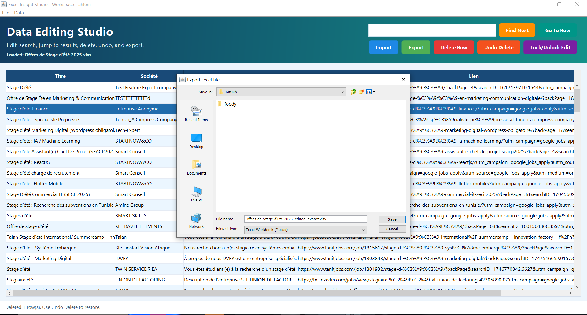
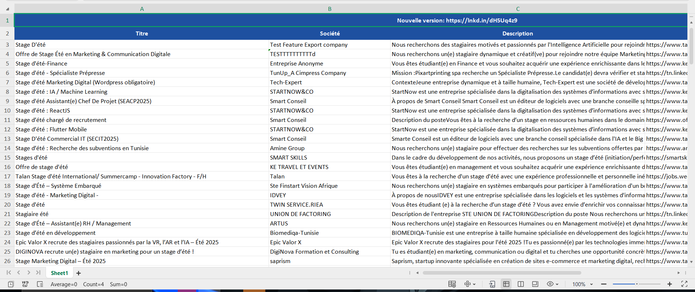

# excel-data-workbench


A Java Swing desktop application, presented in the UI as Excel Insight Studio, for importing, editing, searching, and exporting Excel `.xlsx` files with MySQL-backed user authentication.

It is built as a polished desktop workspace for spreadsheet-heavy tasks where users need more than simple file viewing. The application can load Excel workbooks, detect structured or merged headers automatically, display the data in an editable table, help users search through records quickly, jump to specific rows, remove incorrect entries, undo deletions, and export the updated result back to a clean `.xlsx` file.

The project combines Java Swing for the user interface, Apache POI for Excel processing, and MySQL for account management, making it both a practical utility desktop application. The current authentication layer uses BCrypt for password storage, which means passwords are securely hashed before being stored in the database instead of being saved in plain text.

---

## Features

- **User authentication** : login and registration backed by MySQL with BCrypt password hashing
- **Excel import** : load `.xlsx` files via Apache POI with automatic merged-header detection
- **Editable data grid** : edit cells directly inside the application
- **Search and navigation** : find values across the table and jump to a row instantly
- **Row operations** : delete selected rows and undo deletions
- **Excel export** : export the edited view back to a formatted `.xlsx` file
- **Edit lock** : disable editing when you want to browse safely
- **Modern Swing UI** : redesigned login, registration, and workspace screens

---

## Screenshots

### Authentication

| Login | Register |
|:---:|:---:|
|  |  |

### Workspace

| Empty Workspace | Import |
|:---:|:---:|
|  |  |

### Editing

| Edit Cell | Delete Row |
|:---:|:---:|
|  |  |

### Search & Navigation

| Search | Go-To Row |
|:---:|:---:|
|  |  |

### Export

| Export | Export Results |
|:---:|:---:|
|  |  |

---

## Project Structure

```
Java-Excel-API/
├── src/
│   └── app/
│       ├── App.java                     # Application entry point
│       ├── auth/
│       │   └── AuthService.java         # Login and registration against MySQL
│       ├── model/
│       │   └── ExcelData.java           # Immutable Excel sheet model
│       ├── service/
│       │   ├── ExcelImporter.java       # Excel import logic (Apache POI)
│       │   └── ExcelExporter.java       # Excel export logic (Apache POI)
│       └── ui/
│           ├── LoginFrame.java          # Login UI
│           ├── RegisterFrame.java       # Registration UI
│           ├── MainFrame.java           # Main application frame
│           └── components/
│               ├── GradientPanel.java   # Reusable gradient background panel
│               └── StyledButton.java    # Custom button renderer for consistent styling
├── sql/
│   └── DatabaseSetup.sql                # Database setup script
├── lib/                                 # All dependency JARs
├── screenshots/                         # Application screenshots
├── LICENSE                              # MIT license
├── bin/                                 # Compiled .class files
└── README.md
```

---

## Technologies & Dependencies

| Library | Version | Purpose |
|---|---|---|
| Java Swing / AWT | JDK 8+ | Desktop user interface |
| Apache POI | 4.1.0 | Read and write Excel `.xlsx` files |
| Apache POI OOXML | 4.1.0 | `.xlsx` support layer |
| MySQL Connector/J | 8.0.29 | Database connectivity for authentication |
| jBCrypt | 0.4 | BCrypt password hashing and verification |
| Commons Collections | 4.3 | Extended Java collections |
| Commons Compress | 1.18 | Compression support used by POI |
| Commons Logging | 1.2 | Logging facade |
| CurvesAPI | 1.06 | Spreadsheet drawing and chart support used by POI |
| Activation | 1.1.1 | Mail/activation support required by JAXB on some JDKs |
| JAXB API / Core / Impl | 2.3.x | XML binding required by POI on newer JDKs |
| XMLBeans | 3.1.0 | XML processing used by POI OOXML |

All JARs are included in the `lib/` directory.

---

## Prerequisites

- **Java JDK 8** or higher
- **MySQL** database server running locally
- An IDE such as **Eclipse** or **IntelliJ IDEA** is helpful, but the JDK command line tools are enough

---

## Database Setup

Before running the application, create the required database and users table.

You can run the script in `sql/DatabaseSetup.sql`, or execute this SQL manually:

```sql
CREATE DATABASE IF NOT EXISTS excel_viewer_db;
USE excel_viewer_db;

CREATE TABLE IF NOT EXISTS users (
    id INT AUTO_INCREMENT PRIMARY KEY,
    username VARCHAR(100) NOT NULL UNIQUE,
    email VARCHAR(150) NOT NULL,
    password VARCHAR(60) NOT NULL
);

ALTER TABLE users
    MODIFY password VARCHAR(60) NOT NULL;
```

If your MySQL credentials differ from the defaults, update the JDBC settings in `src/app/auth/AuthService.java`.


---

## Build & Run

### Using Eclipse

1. Import the project into Eclipse.
2. Open the project build path settings.
3. Add all JARs from the `lib/` directory.
4. Run `app.App` as a Java application.

### Using the Command Line

```bash
# Windows PowerShell
javac -cp "lib/*" -d bin (Get-ChildItem src -Recurse -Filter "*.java" | Select-Object -ExpandProperty FullName)

java -cp "bin;lib/*" app.App
```

```bash
# Linux / macOS
javac -cp "lib/*" -d bin $(find src -name "*.java")

java -cp "bin:lib/*" app.App
```

---

## Usage

1. Launch the application.
2. Log in with an existing account, or register a new one.
3. Import an `.xlsx` file from the workspace.
4. Edit cells directly in the table.
5. Use search, go-to-row, delete, and undo as needed.
6. Export the edited result to a new Excel file.

### Keyboard Shortcuts

| Shortcut | Action |
|---|---|
| `Ctrl + O` | Import `.xlsx` file |
| `Ctrl + S` | Export current view |
| `Ctrl + F` | Find next match |
| `Ctrl + Z` | Undo last deletion |
| `Delete` | Delete selected row(s) |

---

## Architecture Overview

```
App (entry point)
    |
    ├── LoginFrame / RegisterFrame  ──► AuthService ──► MySQL
    |
    └── MainFrame
            |
            ├── ExcelImporter ──► Apache POI ──► reads .xlsx into ExcelData
            |
            ├── Editable JTable / DefaultTableModel
            │       ├── direct cell editing
            │       ├── search and row navigation
            │       └── delete / undo workflow
            |
            └── ExcelExporter ──► Apache POI ──► writes edited .xlsx
```

---

## How It Works

### Header Detection

When an Excel file is imported, the application first needs to answer a basic question: which rows are headers, and which rows are actual data?

Instead of asking the user to configure that manually, `ExcelImporter` looks at the sheet's merged cells and uses them as clues.

The logic is:

1. If a merged region starts in the first row and stretches down across multiple rows, the app treats all of those top rows as header rows.
2. If the first row only contains horizontal merges, the app assumes there are two header rows: one row for group labels and one row for the real column names.
3. If there are no useful merges, the app assumes the sheet uses a normal single-row header.

In plain terms, the importer is trying to recognize whether the file uses:

- a simple header like `Name | Email | City`
- a grouped header like `Contact Info` above `Email` and `Phone`
- a deeper multi-row header spread across several rows

That detected value becomes `headerRows`, and the rest of the application uses it to know where the real data starts.

### Merged Cell Propagation

Excel internally stores merged cells in a slightly awkward way: only the top-left cell actually contains the text, while the rest of the merged area is technically blank.

That creates problems when code later tries to read the table as a normal row-and-column grid.

To fix that, the importer copies the visible value from the top-left cell into every cell covered by the merge. After that step, the application can treat the spreadsheet as a complete matrix instead of constantly checking for merge rules.

Example:

- If Excel visually shows `Contact Info` spanning columns A to C,
- the importer fills A, B, and C with `Contact Info` in memory,
- so rendering and exporting logic can work consistently.

### Edit → Export Sync

The table you edit on screen is a live Swing table model, but export works from an `ExcelData` object.

That means the application has to keep those two views of the data in sync.

Whenever you edit a cell or delete rows, `MainFrame` rebuilds the in-memory `ExcelData` object from the current visible table content. This guarantees that export writes exactly what the user sees, not an outdated copy from the original import.

In practice, this means:

- if you change a company name in the grid, the exported file contains the new value
- if you delete rows, the exported file no longer includes them
- header rows and merged-header metadata are still preserved

### Undo Stack

When rows are deleted, the application does not just remove them and forget them.

Before deleting, it stores a snapshot containing:

- the original row position
- the row values that were removed

These snapshots are stored in an `ArrayDeque`, which is being used like a stack.

So when the user clicks Undo Delete:

1. the most recent deletion snapshot is taken from the top of the stack
2. the removed rows are inserted back into their original positions
3. the table and export model become consistent again

This is why multiple undo operations work in reverse order, exactly the way users expect.

---

## Implementation Notes

- The current workspace uses a standard Swing `JTable` to prioritize direct editing, search, row deletion, undo, and export synchronization.
- Password storage uses BCrypt.

---

## License

This project is released under the MIT License. See the LICENSE file for details.
